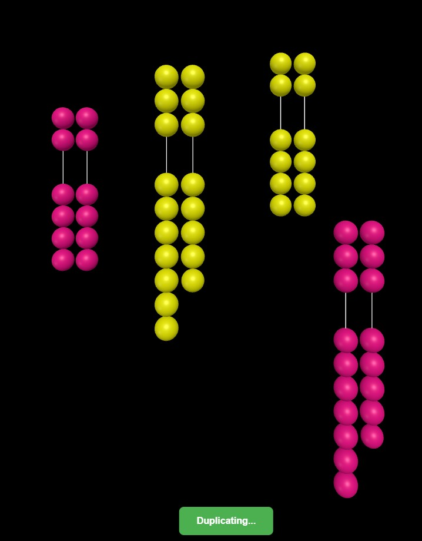

# Meiosis

3D chromosome simulation using Three.js with physics-based animation.

## Preview



## Structure

- **gene_engine.js** - Base 3D engine (scene, physics, ball creation, animations)
- **gene_lab.js** - Chromosome-specific logic (creation, duplication, tetrad formation)

## Usage

```javascript
import { GeneLab } from './gene_lab.js';

const lab = new GeneLab(document.body);
const chromo = lab.addChromosome('o-oo-o', 0xff0000, 0, 0, 0);
const duplicate = await lab.duplicateChromosome(chromo);
await lab.formTetrad4(chromo1, chromo2, chromo3, chromo4);
```
